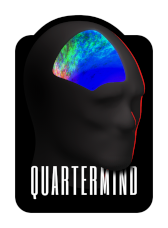

 

A collection of relatively small utility libraries written in C11 that can be used as the foundation for various applications,
perhaps more ideally games.
Includes APIs for dealing with images, graphics, models, IO and much more.

Originally created around 2014/2015 as a support library for another game, it's since found
a new life supporting both the [Yin Game Engine](https://www.hogsy.me/p/yin.html) and [OpenHoW](https://github.com/TalonBraveInfo/OpenHoW) projects.

**Keep in mind this is likely far from the most efficient library in the world. If performance is a big
priority for you then I would highly recommend looking elsewhere!**

## Features

### plcore
- PCMD command-line interface, that exposes features the library has to offer
- Plugin interface for supporting new image and package formats
- C/C++ Math Library (Vector, Matrix, Quaternion)
    - Also provides optional OpenGL-style matrix functions
- Console Interface, with logging, variables and commands
- File I/O is endianness agnostic
- Support for mounting packages; I/O requests will automatically be mapped to any 
mounted packages before falling back to the local FS
- Image API provides manipulation functions
- Supported Image Formats
  - PNG (*read, write*)
  - BMP (*read, write*)
  - GIF (*read*)
  - TGA (*read, write*)
  - PSD (*read*)
  - JPG (*read, write*)
  - HDR (*read*)
  - PIC (*read*)
  - PNM (*read*)
  - 3dfx 3DF (*read*)
  - Monolith DTX (*read*)
  - Ritual FTX (*read*)
  - Ritual SWL (*read*)
  - Sony TIM (*read*)
  - Valve VTX (via plugin) (*read*)
  - Can easily be extended to support other image formats either via the API or via plugins
- Supported Package Formats
  - IBF (Iron Storm)
  - RID/RIM (Eradicator)
  - WAD (Doom)
  - FF (Outwars)
  - MAD/MTD (Hogs of War, Actua Soccer)
  - HAL (Mortyr)
  - SFA (SF Adventures)
  - VSR (Sentient)
  - Can easily be extended to support other package formats either via the API or via plugins

### plgraphics
- Provides a relatively simple abstraction layer
- Camera implementation, supporting Isometric, orthographic and perspective views
- Easy-to-use rendering API
- Supported APIs via plugins, aka 'drivers'
  - OpenGL 3.3
  
### plmodel
- Model API supports static and animated per-vertex/skeletal formats
- Supported Model Formats
    - Cyclone MDL (*read*)
    - Triton HDV (*read*)
    - Unreal 3D (*read*)
    - Valve SMD (*write*)
    - Can easily be extended to support other model formats either via the API or via plugins

## Roadmap

- Vulkan driver (*work in progress*)
- Software driver (*work in progress*)
- 3dfx Glide 3 driver (*todo, for fun*)
- S3 MeTaL driver (*todo, for fun*)
- plwindow; provides windowing API for X11 and Win32
